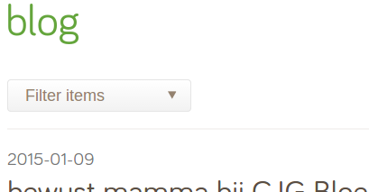

Filterable archive - filter pages by date, tag or category
==========================================================

*Maintained by [Restruct](https://github.com/restruct). If this module saves you time, you can
[support ongoing maintenance](https://github.com/sponsors/restruct).*

This module decorates pages with configurable fields to filter them by. Handy for newsitems & blogs, etc.




*Filter items via dropdowns by date (paginated).*

## Features

* Apply decorators to filter pages by date (year, month/year, or day/month/year)
* Filtering by Tags & Categories, managed per holder page
* Pagination of the (filtered) items, with two ready-made pagination templates
* A filter form template with one dropdown per active filter
* Related items (sharing a tag or category) for an item page

## Requirements

* Silverstripe CMS 5 or 6
* PHP 8.1 or newer (Silverstripe 6 itself needs 8.3)
* [silverstripe/tagfield](https://github.com/silverstripe/silverstripe-tagfield) and
  [symbiote/silverstripe-gridfieldextensions](https://github.com/symbiote/silverstripe-gridfieldextensions),
  installed automatically

## Installation

```
composer require restruct/silverstripe-filterablearchive
```

Then run `dev/build` (Silverstripe 5) or `sake db:build` (Silverstripe 6).

## Version compatibility

| Branch | Module version | Silverstripe | PHP |
|--------|----------------|--------------|-----|
| `master` | `3.1.x` | `^5 \|\| ^6` | `^8.1` |
| (tags only) | `3.0.x` | `^6` | `^8.3` |
| (tags only) | `2.0.11` | `^4 \|\| ^5` | as Silverstripe requires |
| (tags only) | `2.0` - `2.0.10` | `^4` | as Silverstripe requires |

Silverstripe 4 reached end of life in April 2025 and is no longer supported or tested here. Projects
still on it can stay on the `2.0.x` tags, which remain available.

`master` is the only maintained line: it supports every Silverstripe version this module still
targets, so there is no separate maintenance branch.

**`composer.json` is the source of truth** for exact constraints; this table is a quick reference.

## Setup

The module has three extensions: one for the holder page (the page whose children are filtered),
one for the holder's controller, and one for the item pages below it. Apply all three, and tell the
holder which class its items are and which of their fields holds the date:

```yaml
---
Name: app-filterablearchive
---
App\PageTypes\NewsHolder:
  extensions:
    - Restruct\SilverStripe\FilterableArchive\Extensions\HolderExtension
  managed_object_class: App\PageTypes\NewsItem
  managed_object_date_field: Date
  pagination_control_tab: Root.Filtering     # optional, defaults to Root.Main
  # pagination_insert_before: Content        # optional

App\PageTypes\NewsHolderController:
  extensions:
    - Restruct\SilverStripe\FilterableArchive\Extensions\HolderControllerExtension

App\PageTypes\NewsItem:
  extensions:
    - Restruct\SilverStripe\FilterableArchive\Extensions\ItemExtension
```

Then, in the CMS, enable the date archive, categories and/or tags on the holder page and
save/publish it. Categories and tags are created on the holder (or inline, from an item's tag
field) and belong to that holder only.

[restruct/silverstripe-newsgrid](https://github.com/restruct/silverstripe-newsgrid) (manage news
items from a GridField) applies this module for you when both are installed.

### Configuration

All options are set on the **holder** class. Setting them on the holder class is what the module
reads; the defaults come from `HolderExtension`.

| Option | Default | What it does |
|---|---|---|
| `managed_object_class` | `Page` | Class of the items below the holder that are listed and filtered. |
| `managed_object_date_field` | `Created` | Field of the item that the date archive filters and sorts on (newest first). When it is not `Created` or `LastEdited`, items get an edit field for it (a date field for a `Date`, a date-and-time field for a `Datetime`). |
| `pagination_active` | `true` | Show the "items per page" field on the holder. |
| `pagination_control_tab` | `Root.Main` | CMS tab the holder's filter settings are placed on. |
| `pagination_insert_before` | not set | Name of a field on that tab to place the settings before; ignored if no such field exists. |
| `datearchive_active` | `'Date'` | A falsy value (eg `false`) switches the date archive off for the class; otherwise it is the dropdown's default label. |
| `categories_active` | `'Categories'` | Same, for categories. |
| `tags_active` | `'Tags'` | Same, for tags. |

Per holder page (CMS): the date archive, categories and tags each have an "Enable" checkbox and a
label; the date archive has a unit (year, month or day); "items per page" of `0` or empty means no
pagination.

A dropdown's label is, in order: the label set on the holder page, the argument passed in the
template (see below), the config value above.

## Templates

Include these from the holder's template (they run in the controller's scope):

```
<% include FilterableArchiveFilter %>          <%-- a form with one dropdown per active filter --%>

<% loop $PaginatedItems %>
    ...
<% end_loop %>

<% include FilterableArchivePagination %>      <%-- or FilterableArchiveBootstrapPagination --%>
```

And from an item's template (or inside a loop over items), to show its date, categories and tags:

```
<% include FilterableProperties LinkFilterProps=1 %>
```

`LinkFilterProps` links each category/tag to the holder filtered by it; `ShowDateBelow` moves the
date after them; a `DateFieldComment` method on the item, if present, is printed next to the date.

The active filter comes from GET parameters (`?date=2024-05&cat=press&tag=blue`, as the filter form
submits them) or from these URLs on the holder: `date/2024-05`, `cat/press`, `tag/blue`. The older
`archive/2024/05` form still works.

## Public API

On the holder (`HolderExtension`):

| Method | Returns |
|---|---|
| `getItems()` | Unfiltered items: `managed_object_class` children of the holder, newest first. Extensions can change the list through the `updateGetItems(&$items)` hook. |
| `Categories()`, `Tags()` | The holder's categories and tags (`FilterProp` records). |
| `ArchiveActive()`, `CategoriesActive()`, `TagsActive()` | Whether that filter is switched on by config AND on the page. |
| `ArchiveFilterDropdown($label = null)` | The date dropdown, or null while the archive is off. |
| `FilterDropdown('cat'\|'tag', $label = null)` | The category or tag dropdown, or null while that filter is off. |

On the holder's controller (`HolderControllerExtension`):

| Method | Returns |
|---|---|
| `PaginatedItems()` | The filtered items, paginated by the holder's "items per page". |
| `getFilteredArchiveItems()` | The filtered items, unpaginated. A category or tag that does not exist on this holder is ignored. |
| `getFilteredDate()`, `getFilteredCatSegment()`, `getFilteredTagSegment()` | The active filter values (`yyyy[-mm[-dd]]`, or a URL segment), or null. |

On an item (`ItemExtension`):

| Method | Returns |
|---|---|
| `Categories()`, `Tags()` | The item's categories and tags (a many_many through `FilterPropRelation`). |
| `getHolderPage()` | The nearest ancestor page with `HolderExtension`, or null. |
| `getDateField()` | The item's date as a DB field object (per the holder's `managed_object_date_field`), or null without a holder. |
| `getRelatedItems()` | Other items sharing a tag or category with this one (only for filters the holder has on), each listed once. |

On a category or tag (`FilterProp`): `Title`, `URLSegment` (derived from the title on write),
`Link` (the holder, filtered by it) and `Items()` (the pages linked to it).

## Running the tests

The module cannot be tested on its own: it needs a host Silverstripe project. Require it there
through a Composer **path repository with `symlink: true`** - `/tests` is `export-ignore`, so a dist
or mirrored install contains no tests - add its test namespace to the host's `autoload-dev`
(`"Restruct\\SilverStripe\\FilterableArchive\\Tests\\": "vendor/restruct/silverstripe-filterablearchive/tests/"`),
then:

```bash
# Silverstripe 5 (PHPUnit 9) - the path must come before flush=1
vendor/bin/phpunit vendor/restruct/silverstripe-filterablearchive/tests flush=1

# Silverstripe 6 (PHPUnit 11) - a flush=1 argument is ignored, use the env var
SS_PHPUNIT_FLUSH=1 vendor/bin/phpunit vendor/restruct/silverstripe-filterablearchive/tests
```

CI runs the same suite against Silverstripe 5 and 6 on every push; see `.github/workflows/ci.yml`.
Changes per release: [CHANGELOG.md](CHANGELOG.md).
